## Web 
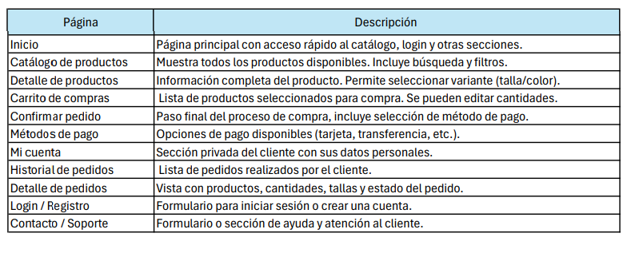
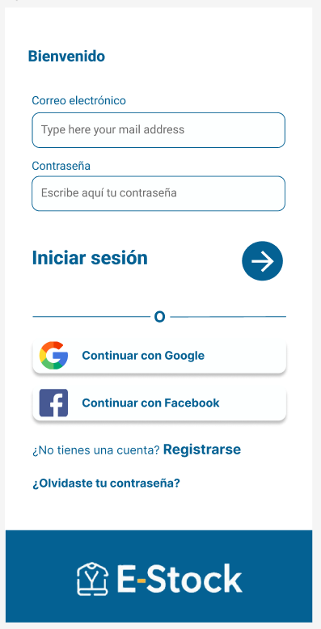
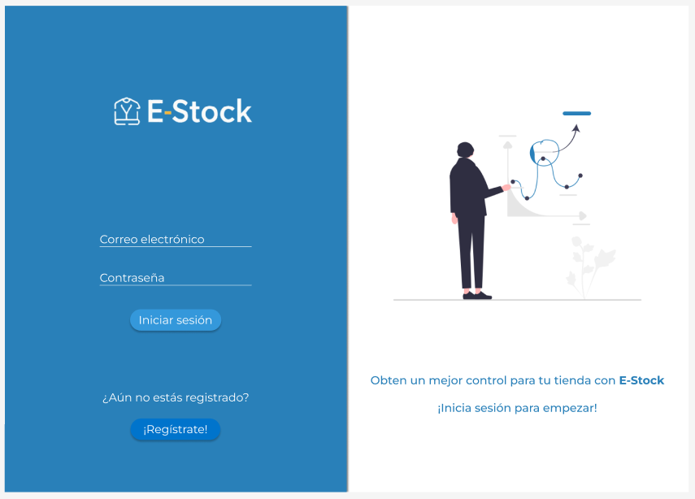
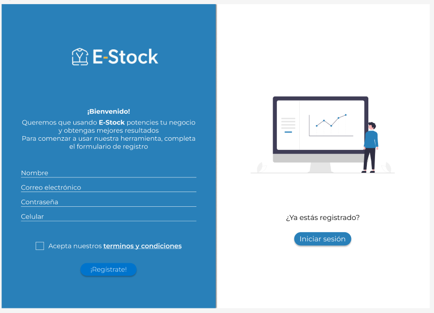
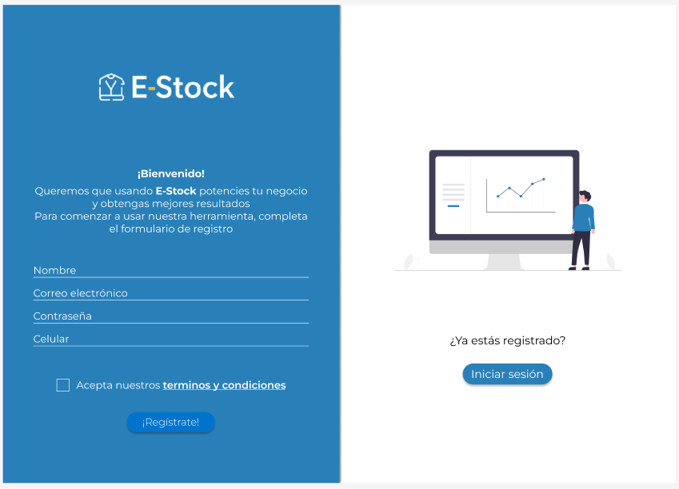
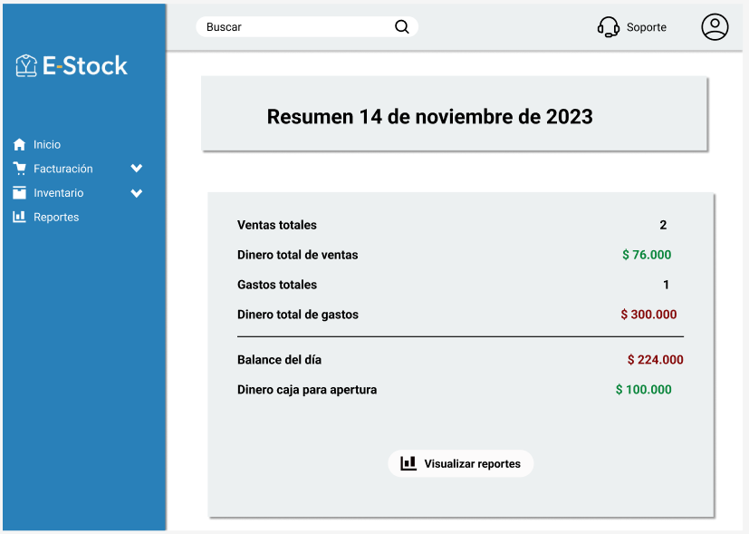
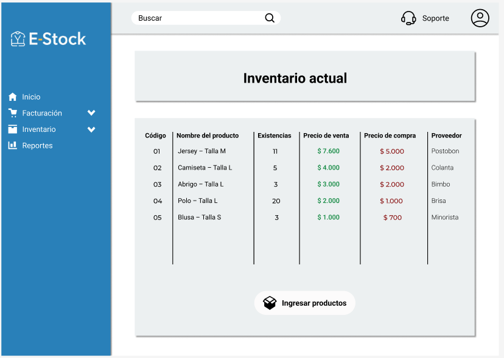
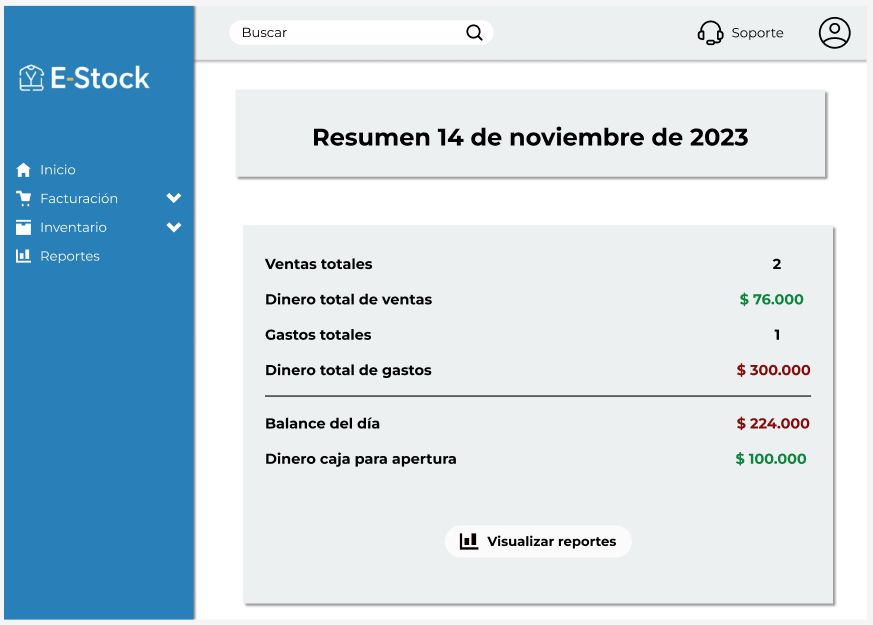

## Móvil
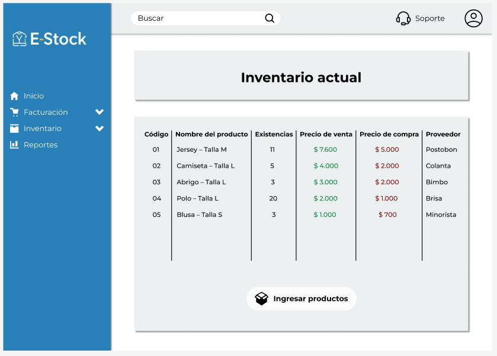
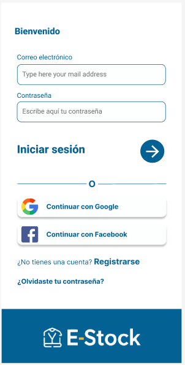
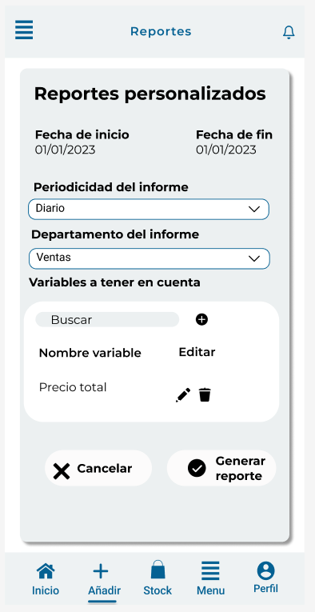
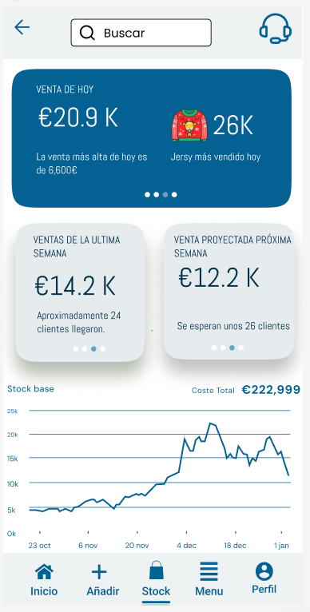
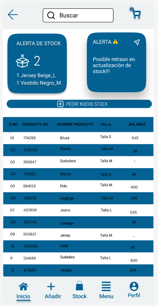
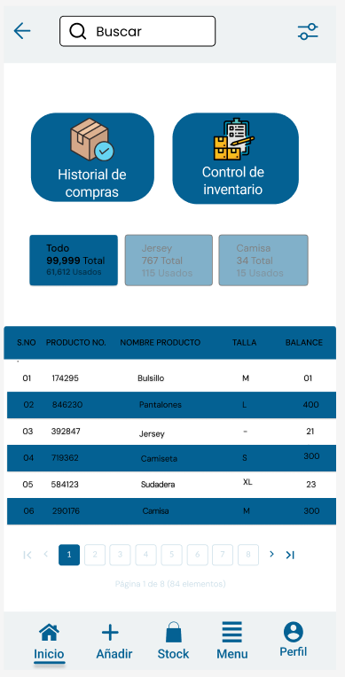
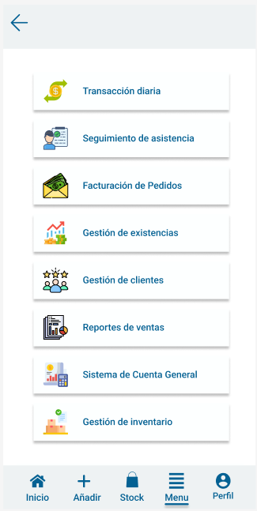
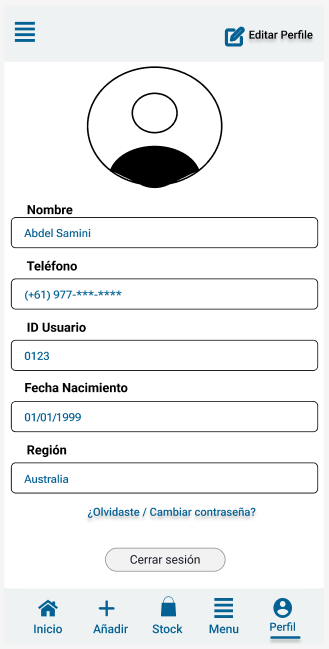

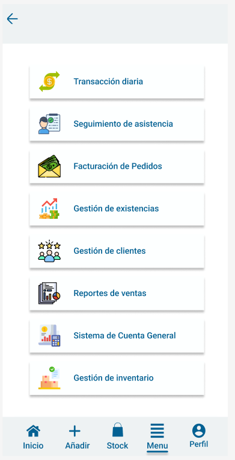

## Justificación del diseño 

El diseño de **Gestor de E-Stock** se orienta a la **eficiencia**, **profesionalismo** y **accesibilidad**, con el objetivo de ofrecer una experiencia superior a la de las herramientas manuales.

## Diseño del Sistema

| **Elemento** | **Especificación** | **Justificación Profesional** |
|---------------|--------------------|--------------------------------|
| **Color Primario** | Azul Oscuro `#046193` | Transmite confianza y estabilidad, esencial para una aplicación de gestión financiera y de inventario. Proporciona alto contraste.  |
| **Color Secundario** | Azul Claro `#ECF0F1` | Utilizado para los call-to-action (CTAs) y elementos interactivos, guiando al usuario hacia las acciones clave.  |
| **Tipografía** | Roboto | Máxima legibilidad en todos los dispositivos (web y móvil), clave para la rápida asimilación de datos. |
| **Composición** | Navegación Lateral/Inferior | Estándar de la industria para herramientas de gestión. Garantiza navegación rápida y acceso constante a las métricas clave.  |

## Justificación de Usabilidad

El diseño se adhiere rigurosamente a los **principios de usabilidad** para minimizar la curva de aprendizaje y los errores operativos del comerciante: 

- **Diseño Minimalista:** Se priorizan los datos críticos (como las tarjetas de métricas en Reportes), eliminando el ruido visual para facilitar la toma de decisiones rápida. 

- **Consistencia y Estándares:** El uso uniforme de elementos de navegación y colores de estado (ej. rojo para alerta de stock bajo) reduce la carga cognitiva. 

- **Reconocimiento:** La navegación persistente (barra lateral/menú inferior) con iconos claros permite al usuario operar sin necesidad de recordar rutas, mejorando la eficiencia. 

- **Feedback:** Uso de notificaciones y estados visuales (ej. botones de éxito tras guardar) para mantener al usuario siempre informado sobre el estado del sistema. 

## Accesibilidad y Diseño Inclusivo

- **Claridad Visual Total:**  El alto contraste en los colores asegura que las cifras de stock y los pedidos sean fáciles de leer al instante, incluso con prisa o con problemas de visión. Queremos que el vendedor vea lo que necesita ver, sin esfuerzo.  
- **Adaptabilidad Total:** El diseño responsive garantiza que, estés en el móvil en la calle o en la oficina con el PC, la aplicación siempre te dará el control sin obligarte a hacer malabares en la pantalla.   
- **Eficiencia en Cada Tecla:** Implementamos la navegación por teclado para que los gestores puedan trabajar más rápido. Si dominan el teclado, dominan la aplicación. Es un diseño que respeta el tiempo y la habilidad del usuario.  

