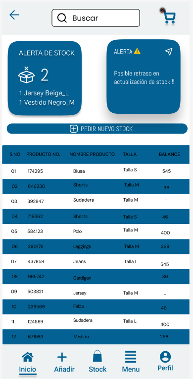

## Web 

## Móvil

## Justificación del diseño – E-Stock

### Colores
El diseño de E-Stock busca transmitir profesionalismo, claridad y confianza. La interfaz combina tonos azules y blancos para generar una sensación de orden y seguridad, garantizando además un buen contraste visual que cumple con los estándares WCAG de accesibilidad.

### Tipografía
La tipografía Roboto fue elegida por su legibilidad en pantallas digitales y su estilo moderno. La jerarquía tipográfica facilita la lectura y ayuda al usuario a identificar rápidamente la información más importante.

### Iconografía
Los iconos lineales refuerzan la coherencia visual y la comprensión de las acciones, aplicando principios de diseño básico.

### Composición y estructura
La estructura limpia y equilibrada, con una barra lateral fija y amplios espacios en blanco, mejora la navegación y reduce la carga visual. Los botones y formularios son claros y accesibles, alineados con las heurísticas de Nielsen, especialmente las de visibilidad, consistencia y control del usuario.

### Accesibilidad y diseño centrado en el usuario
En conjunto, el diseño prioriza la usabilidad, accesibilidad y experiencia del usuario, ofreciendo una interfaz simple, funcional y confiable.
