#  Capturas Finales del Sistema - Gestor de E-Stock

###  1. Pantalla de Inicio de Sesión (Login)
*Descripción:* Interfaz donde los usuarios introducen sus credenciales para acceder al sistema.

 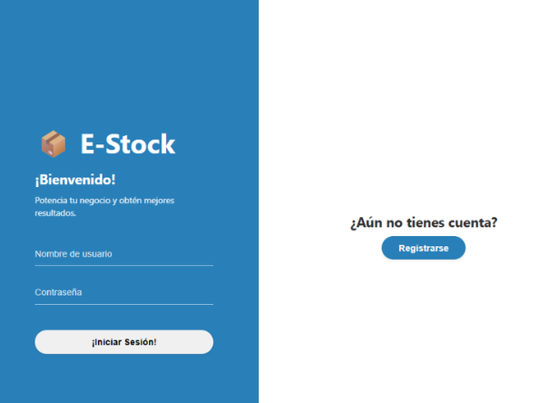

###  Pantalla de Registro de Usuarios
*Descripción:* Formulario para dar de alta nuevos usuarios en la plataforma.

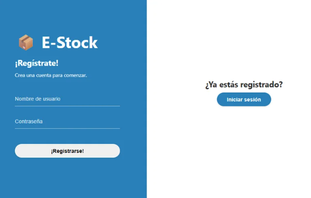
##  2. Facturación y creacion de factura

---

##  3. Gestión de Inventario y Productos

###  Lista de Productos / Inventario General
*Descripción:* Tabla con todos los productos registrados, filtros de búsqueda, categorías y estado del stock.

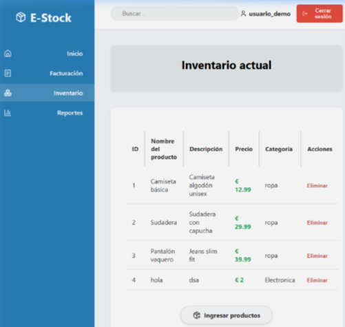
### Ingreso de Producto 
*Descripción:* Formulario para registrar nuevos productos o añadir existencias a los ya existentes.

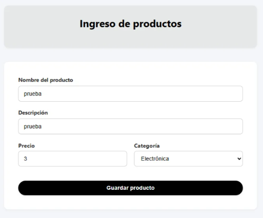

##  4. Panel de Control (Dashboard)

###  Dashboard Principal
*Descripción:* Resumen de stock bajo, últimas transacciones, gráficos de ingresos y accesos rápidos.

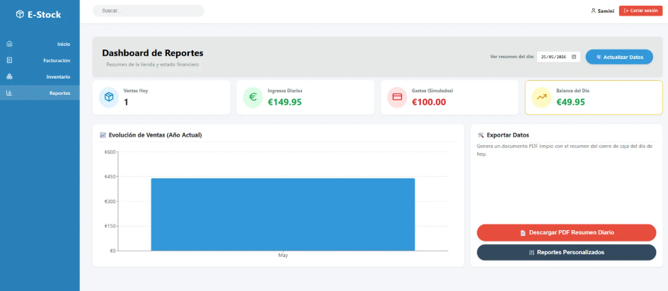

###  Generación de Reportes

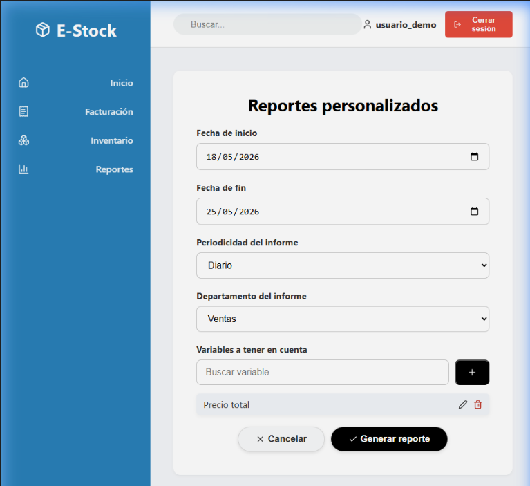

##  Versión Móvil 

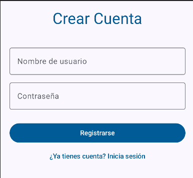

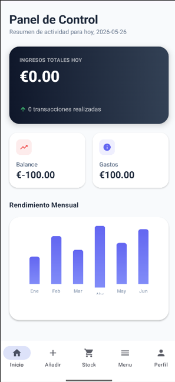
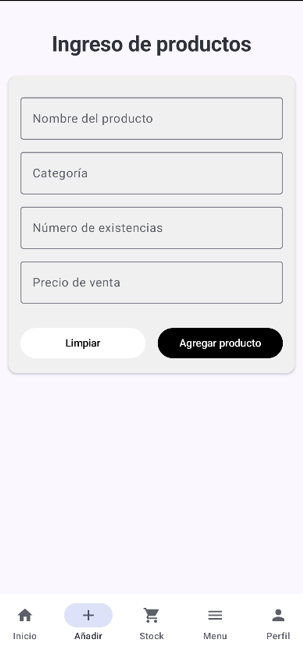
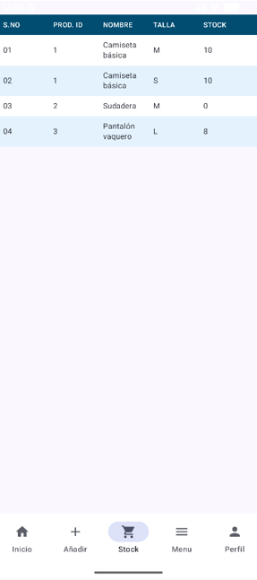
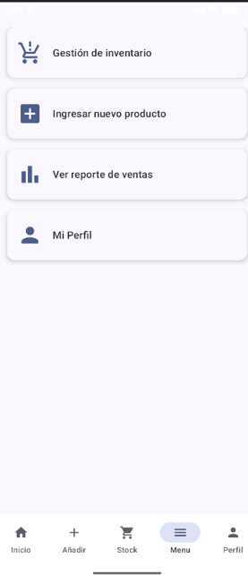
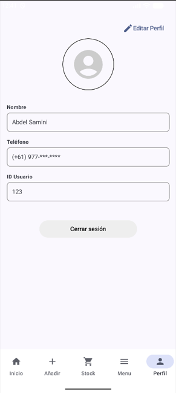