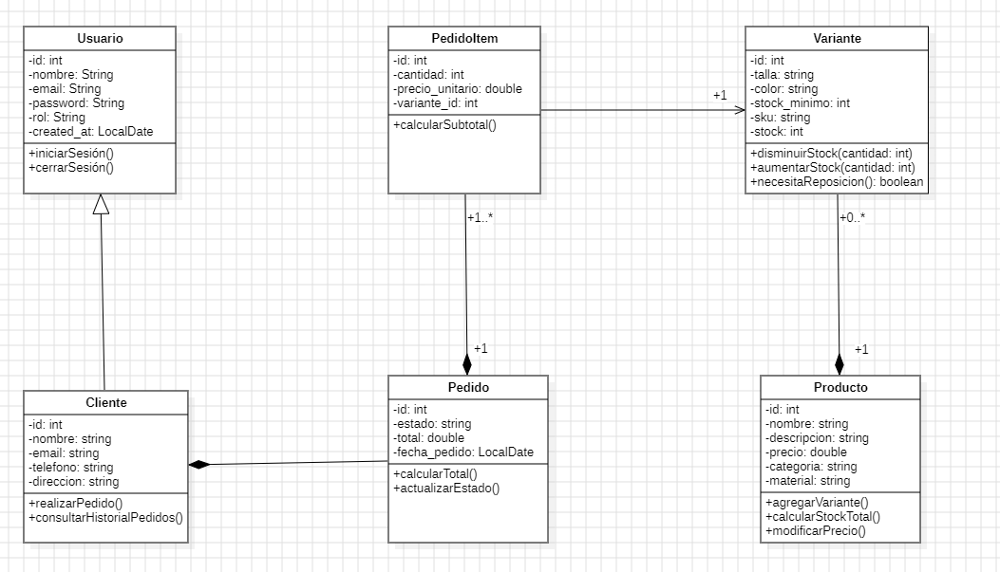

##  Los Tres casos de usos principales del Sistema:

A continuación los tres casos de uso clave del sistema, fundamentales para su funcionamiento y experiencia del usuario.

### 1. Procesar Pedido 

Este es el núcleo del sistema: permite vender productos, registrar pedidos y controlar el stock.

**Incluye:**
- Verificación de stock antes de confirmar la compra.
- Registro del pedido y sus ítems.
- Actualización del stock de cada variante (talla, color, etc.).

**Entidades involucradas:** `Clientes`, `Pedidos`, `Pedido_items`, `Variantes`  
**Operaciones:** `INSERT`, `SELECT`, `UPDATE`

### 2.  Gestión de Productos y Variantes

Permite mantener el catálogo actualizado y bien organizado.

**Incluye:**
- Crear, editar o eliminar productos.
- Añadir variantes (por talla, color, etc.).
- Identificar variantes con bajo stock.

**Entidades:** `Productos`, `Variantes`  
**Operaciones:** `INSERT`, `UPDATE`, `DELETE`, `SELECT`

### 3. Consulta de Historial de Pedidos del Cliente

Ofrece a los usuarios acceso a sus compras anteriores y facilita la atención al cliente.

**Incluye:**
- Listado de pedidos por cliente.
- Detalle de cada pedido: productos, cantidades, tallas, etc.

**Entidades:** `Clientes`, `Pedidos`, `Pedido_items`, `Variantes`, `Productos`  
**Operaciones:** `SELECT`, `JOIN`

Estas funcionalidades aseguran una experiencia fluida, eficiente y confiable tanto para los usuarios como para los administradores del sistema.

### Diagrama UML :

